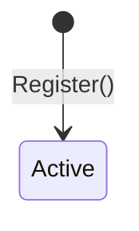

# Authors

| Field | Value |
|:---|:---|
| Status | Active |
| Last updated | 2026-05-23 |

---

## Ubiquitous Language

| Term | Definition | Maps To | Do Not Use |
|:---|:---|:---|:---|
| Author | A registered admin user who creates and manages Posts and Tags. Identity comes from the authenticated session. | `Author` aggregate | Writer, Creator, User |
| Display Name | Human-readable name shown on published posts. Sourced from GitHub profile on registration. | `Author.DisplayName` | Username, Nickname |

---

## Aggregate: `Author`

Identity: `AuthorId` (strongly typed `Guid`). Maps 1:1 to the JWT `sub` claim from GitHub OAuth.

### State transitions

### Invariants

- One Author record per GitHub user ID.
- Registration is idempotent: existing authors are returned without duplicate rows.
- Only the configured GitHub owner (`GITHUB_OWNER_ID`) may authenticate to the admin app.

---

## Domain Events

| Event | Raised when | Outbox required |
|:---|:---|:---:|
| `AuthorRegistered` | `Author` constructor | No (v1) |

---

## Persistence

| Table | Purpose |
|:---|:---|
| `authors` | Author aggregate root |

---

## Use Cases

| Use case | Doc | Backend | Frontend |
|:---|:---|:---|:---|
| Register author | [register-author.md](register-author.md) | `Authors/Register/` + `EnsureAuthorMiddleware` | Automatic on admin login |
