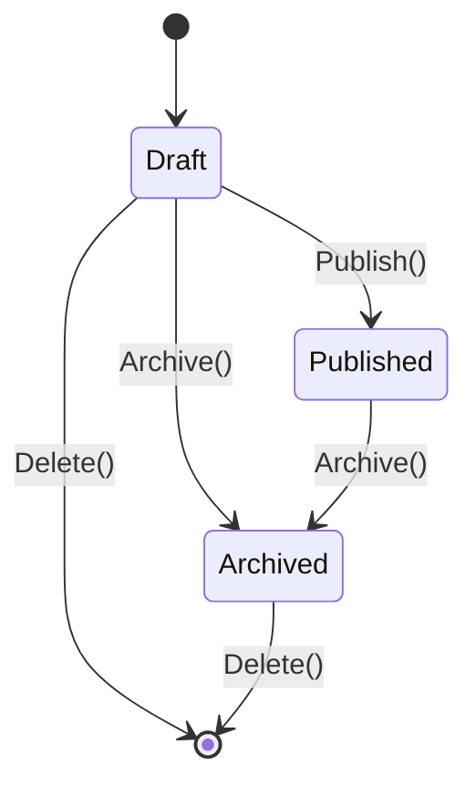

# Posts

| Field | Value |
|:---|:---|
| Status | Active |
| Last updated | 2026-05-23 |

---

## Ubiquitous Language

| Term | Definition | Maps To | Do Not Use |
|:---|:---|:---|:---|
| Post | A piece of content created by an Author. Moves through Draft, Published, and Archived states. | `Post` aggregate | Article, Content, Entry, BlogPost |
| Draft | Initial state. Not visible on the public web. Editable. | `DraftPostState` | Unpublished, WIP, Private |
| Published | Publicly visible on the blog. Slug is immutable. | `PublishedPostState` | Live, Active, Visible |
| Archived | Removed from public view without permanent deletion. Cannot be re-published. | `ArchivedPostState` | Deleted, Hidden, Inactive |
| Slug | URL-safe identifier derived from title. Immutable once published. | `PostSlug` | Path, URL, Handle |
| Rich Text Content | Post body stored as ProseMirror JSON (TipTap in admin). | `PostContent` | Body, HTML, Description |
| Excerpt | Plain-text summary for listings and social previews. Max 500 chars. | `PostExcerpt` | Summary, Teaser, Preview |
| Cover Image | Optional absolute URL for a hero image. | `PostCoverImageUrl` | Thumbnail, Banner, Hero |

---

## Aggregate: `Post`

Identity: `PostId` (strongly typed `Guid`).

### State transitions

### Invariants

- Created in Draft state only.
- `Update()` allowed in Draft only. Throws `PostNotEditableException` otherwise.
- `Publish()` allowed from Draft only. Throws `PostAlreadyPublishedException` if already published.
- `Archive()` throws `PostAlreadyArchivedException` if already archived.
- Archived posts cannot be re-published.
- `Delete()` forbidden when Published. Throws `PostCannotBeDeletedException`.
- Slug regenerated from title on create and update (while Draft). Immutable after publish.
- Maximum 10 tags per post. Throws `PostTagLimitExceededException`.
- Duplicate tag assignment throws `PostTagAlreadyAssignedException`.
- Removing unassigned tag throws `PostTagNotAssignedException`.
- `AuthorId` set at creation from JWT; never from request body.

---

## Domain Events

| Event | Raised when | Outbox required |
|:---|:---|:---:|
| `PostCreated` | `Post.Create()` | No (v1) |
| `PostUpdated` | `Post.Update()` | No |
| `PostPublished` | `Post.Publish()` | No |
| `PostArchived` | `Post.Archive()` | No |
| `PostDeleted` | `Post.Delete()` | No |
| `PostTagAdded` | `Post.AddTag()` | No |
| `PostTagRemoved` | `Post.RemoveTag()` | No |

---

## Persistence

| Table | Purpose |
|:---|:---|
| `posts` | Post aggregate root (snake_case columns) |
| `post_tags` | Many-to-many join between posts and tags |

Key relationships: `posts.author_id` → `authors.id`; `post_tags` → `posts.id`, `tags.id`.

---

## Use Cases

| Use case | Doc | Backend | Frontend |
|:---|:---|:---|:---|
| Create post | [create-post.md](create-post.md) | `Posts/Create/` | `features/posts/create/` (admin) |
| Update post | [update-post.md](update-post.md) | `Posts/Update/` | `features/posts/update/` (admin; shared editor surface) |
| Publish post | [publish-post.md](publish-post.md) | `Posts/Publish/` | `features/posts/update/` (admin; action on editor) |
| Archive post | [archive-post.md](archive-post.md) | `Posts/Archive/` | `features/posts/update/` (admin; action on editor) |
| Delete post | [delete-post.md](delete-post.md) | `Posts/Delete/` | `features/posts/update/` (admin; action on editor) |
| Add tag to post | [add-tag-to-post.md](add-tag-to-post.md) | `Posts/AddTag/` | `features/posts/update/`, `features/posts/create/` (admin) |
| List published posts | [list-published-posts.md](list-published-posts.md) | `Posts/GetPublishedPosts/` | `features/posts/list-published-posts/` (web; admin list inline in route shell) |
| View post by slug | [view-post-by-slug.md](view-post-by-slug.md) | `Posts/GetPostBySlug/` | `features/posts/view-post-by-slug/` (web) |
