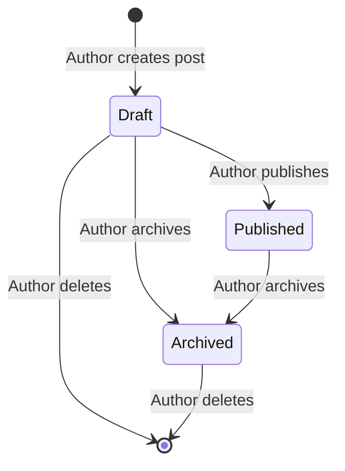

# How LitePress Works

A plain-language guide to what the blog does, who uses what, and how content moves from draft to published page. No code required.

---

## The three parts

LitePress is really three connected products:

| Part | Who uses it | What it does |
|:---|:---|:---|
| **Public website** | Anyone on the internet | Read published posts, browse tags, leave comments |
| **Admin dashboard** | The blog owner (you) | Write, edit, publish, and organize posts |
| **Backend API** | Hidden from visitors | Stores posts and tags securely; serves content to the website |

You typically host the public website where readers find you (for example `blog.example.com`) and keep the admin on a separate URL (for example `admin.example.com` or localhost during development).

---

## Reading the blog (public website)

### Home page

The home page lists **published** posts, newest first. Each entry shows a title, optional excerpt, tags, and date. You can paginate through older posts.

### Post pages

Each post has a human-readable URL based on its title (a **slug**), for example `/my-first-post`. The page shows:

- Title, author name, and publish date
- Full article content (rich text: headings, lists, code blocks, and so on)
- Tags linking to filtered views
- Comments (when Giscus is configured)

Posts that are still drafts or archived are **not** visible here.

### Tags

- **`/tags`** lists all tags and how many posts use each one.
- **`/tags/some-tag`** lists published posts with that tag.

### Search engines and sharing

Published pages include metadata for search engines and social previews (title, description, Open Graph, Twitter cards). A sitemap and robots file help crawlers find public content.

---

## Writing and publishing (admin dashboard)

### Signing in

Only the blog owner can use the admin. Sign-in is via **GitHub**. The system checks your GitHub account ID against a configured owner ID; everyone else is turned away.

You do not need a separate password for the blog itself.

### Dashboard

After sign-in you see a summary: total posts, how many are published, drafts, and tags.

### Posts

**Creating a post**

1. Go to **Posts → New Post**.
2. Enter title, body (TipTap rich-text editor), optional excerpt, optional cover image URL.
3. Save — the post starts as a **Draft**.

**Editing a draft**

- Change title, content, excerpt, or cover image.
- Assign tags (up to 10 per post) while the post is still a draft.
- Slug updates automatically from the title while in draft.

**Publishing**

- Click **Publish** on a draft. It becomes **Published**, gets a publish timestamp, and appears on the public website.
- Once published, the slug is fixed and the post cannot be edited like a draft (archive instead if you want it off the site).

**Other actions**

| Action | When | Effect |
|:---|:---|:---|
| **Archive** | Published post | Removed from public site; kept in database |
| **Delete** | Draft or archived | Permanently removed |
| **Save changes** | Draft only | Updates content in place |

### Tags

From **Tags** you can:

- **Create** a new tag
- **Rename** a tag (slug updates from the new name)
- **Delete** a tag

Tags are shared across posts. Assign them on the post edit screen while the post is still a draft.

---

## Comments

Comments on the public site use **Giscus**, which stores discussions in a GitHub repository you configure. Readers comment with their GitHub account. The blog does not host its own comment database.

If Giscus is not configured, post pages simply omit the comments section.

---

## Content lifecycle

**Draft** — Only visible in admin. Editable. Can receive tags.

**Published** — Visible on the public website. Slug is locked.

**Archived** — Hidden from the public site. Can be deleted but not re-published in v1.

---

## What is not in v1

These are intentionally out of scope for the first release:

- Scheduled publishing (“post at 9am tomorrow”)
- Uploading cover images to cloud storage (URL strings only)
- Multiple authors with different permissions
- Built-in analytics dashboard

See [v1-scope-deferrals.md](decisions/v1-scope-deferrals.md) for the full list.

---

## Where to go next

| If you want to… | Read |
|:---|:---|
| Set up the project locally | [Technical development guide](technical/development.md) |
| Understand the architecture | [Technical architecture](technical/architecture.md) |
| See every API endpoint | [API reference](technical/api-reference.md) |
| Change product behavior | [Domain docs](domain/README.md) (update docs with code) |
