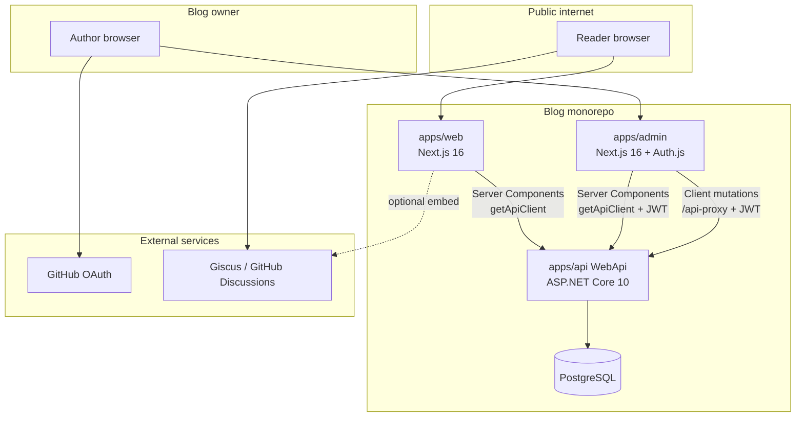
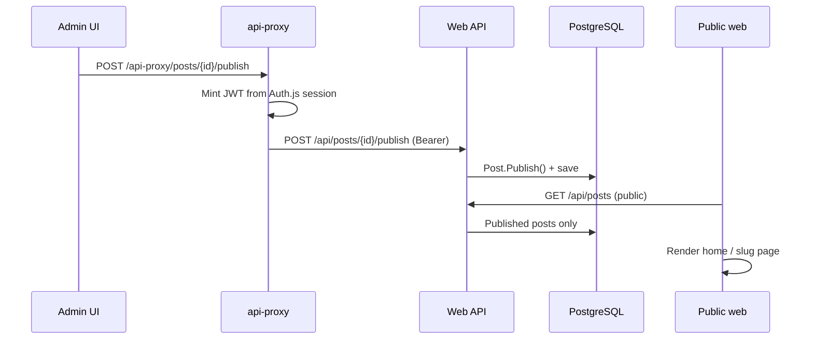

# Architecture

How LitePress is structured technically: three deployable apps, one API, one database, and shared TypeScript packages.

---

## System overview



---

## Three frontends, one backend

| App | Port (dev) | Auth | Talks to API |
|:---|:---|:---|:---|
| `apps/web` | 3000 | None (public reads) | Server-side `getApiClient()` → `API_URL` |
| `apps/admin` | 3002 | Auth.js GitHub OAuth | Server: `getApiClient()` with minted JWT; client: `/api-proxy` |
| `apps/api` | 5000 | JWT Bearer on mutating routes | PostgreSQL via EF Core |

Both Next.js apps are independent: each has its own `domain/{feature}/{use-case}/` tree. They do not import from each other.

See [dual-nextjs-apps.md](../decisions/dual-nextjs-apps.md).

---

## API: clean architecture + CQRS

```
WebApi (IEndpoint)
    ↓ mediators
Application.Write / Application.Read / Application.Reactions
    ↓
Domain (aggregates, events, invariants)
    ↓
Infrastructure (EF Core, repositories, pipeline)
```

| Project | Responsibility |
|:---|:---|
| `Domain` | `Post`, `Tag`, `Author` aggregates; domain events and exceptions |
| `Application.Write` | Command handlers (create, publish, archive, …) |
| `Application.Read` | Query handlers; projections via `IDatabaseContext` only |
| `Application.Reactions` | Event handlers (v1: log-only side effects) |
| `Infrastructure` | DbContext, repositories, naming conventions, DI |
| `WebApi` | Minimal API endpoints, JWT, CORS, OpenAPI, middleware |

**Rules that matter:**

- Endpoints use `ICommandMediator` / `IQueryMediator`, not controllers.
- `AuthorId` comes from JWT `sub` claim only — never from request body.
- Query handlers never inject repositories; they project from `IDatabaseContext`.
- No `SaveChangesAsync` in handlers; the command pipeline persists.

Full rules: [Engineering Standards — clean architecture](https://github.com/Litenova-Solutions/Engineering-Standards/blob/main/docs/architecture/clean-architecture.md).

---

## Publish flow (end to end)



The E2E CI workflow automates this path: API creates and publishes a post, then Playwright asserts it appears on the public site.

---

## Content format

Post bodies are stored as **ProseMirror JSON** (from TipTap in admin). The public web renders JSON to safe HTML server-side via `@tiptap/html`.

See [prosemirror-json-storage.md](../decisions/prosemirror-json-storage.md).

---

## Authentication model

| Layer | Mechanism |
|:---|:---|
| Admin sign-in | Auth.js v5 + GitHub OAuth; single owner via `GITHUB_OWNER_ID` |
| Admin → API | Short-lived HS256 JWT minted server-side (`API_JWT_SECRET` = API `JwtSettings:Secret`) |
| API mutating routes | `[Authorize]` + JWT validation |
| Author registration | `EnsureAuthorMiddleware` auto-registers author on first authenticated request |
| Public reads | No auth; API returns published content only |

See [admin-auth.md](../decisions/admin-auth.md).

---

## Shared TypeScript packages

| Package | Purpose |
|:---|:---|
| `@litepress/api-types` | OpenAPI-generated TypeScript types (`paths`, `components`) |
| `@litepress/api-client` | Re-export of `openapi-fetch` `createClient` |
| `@litepress/config-*` | Shared ESLint, TypeScript, Tailwind presets |

Regenerate types after API contract changes:

```bash
pnpm generate:api-types
```

Requires a running API or committed `packages/api-types/openapi.json`.

---

## Domain documentation (ADDD)

Feature behavior is documented under `docs/domain/` using Agentic Domain-Driven Design:

- Feature README: ubiquitous language, invariants, events
- Use-case doc: commands, endpoints, UI flows, acceptance criteria

When code and docs disagree, fix both in the same change.

Guide: [standards — agentic DDD](https://github.com/Litenova-Solutions/Engineering-Standards/blob/main/docs/guides/agentic-domain-driven-design.md).

---

## SEO (public web)

Server Components fetch data and emit `generateMetadata`, JSON-LD `BlogPosting`, `sitemap.xml`, and `robots.txt`.

See [seo-public-web.md](../decisions/seo-public-web.md).

---

## Out of scope (v1)

Scheduled publishing, R2 uploads, multi-author RBAC, outbox/worker, production VPS deploy scripts.

See [v1-scope-deferrals.md](../decisions/v1-scope-deferrals.md).
